.. _beauti-vignette:

Building a Germline-Root TyCHE Analysis in BEAUti
=================================================

Using BEAUti
------------

This is a quick-start guide to setting up a TyCHE analysis
with a Germline-rooted tree and a TyCHE trait with linked
clock rates using BEAUti.

--------------

Requirements
------------

**You’ll need:**

-  BEAST 2.7.7 and BEAUti (comes with BEAST2)
-  TyCHE (v0.0.11 or later)
-  a FASTA or NEXUS alignment, with a sequence named ``Germline``. This walkthrough uses a 4-taxon glioma dataset
   (``GLSS-4F0A.fasta``) which is available in the TyCHE package's
   ``examples/fasta`` folder or on GitHub (link here). Your data can have any number of taxa and any names, as long as
   exactly one tip is named ``Germline``.

.. include:: installation_guide.rst

1. Import the alignment as a Germline-Root Alignment
----------------------------------------------------

Partitions tab → **+** → **Import Germline-Root Alignment** from the
dropdown → OK.

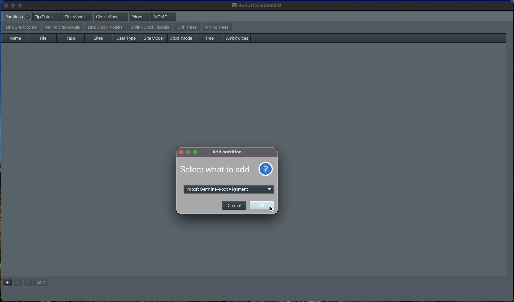

   Add partition dialog, Import Germline-Root Alignment selected

A file picker opens next. Navigate to your alignment file and open it.
BEAUti builds the partition and, as part of this specific import option,
automatically:

-  Sets up a germline-rooted tree, with ``Germline`` as the outgroup.
-  Chooses a compatible tree prior (currently, only GRTBayesianSkyline is confirmed to be compatible) and tree operators.
-  Adds the priors that keep ``Germline`` as the outgroup throughout the
   analysis.

None of this needs any further action from you — it’s all done by the
time the partition appears in the table.

2. Add a TyCHE trait partition
------------------------------

Partitions tab → **+** → **Add TyCHE Trait** from the dropdown → OK.

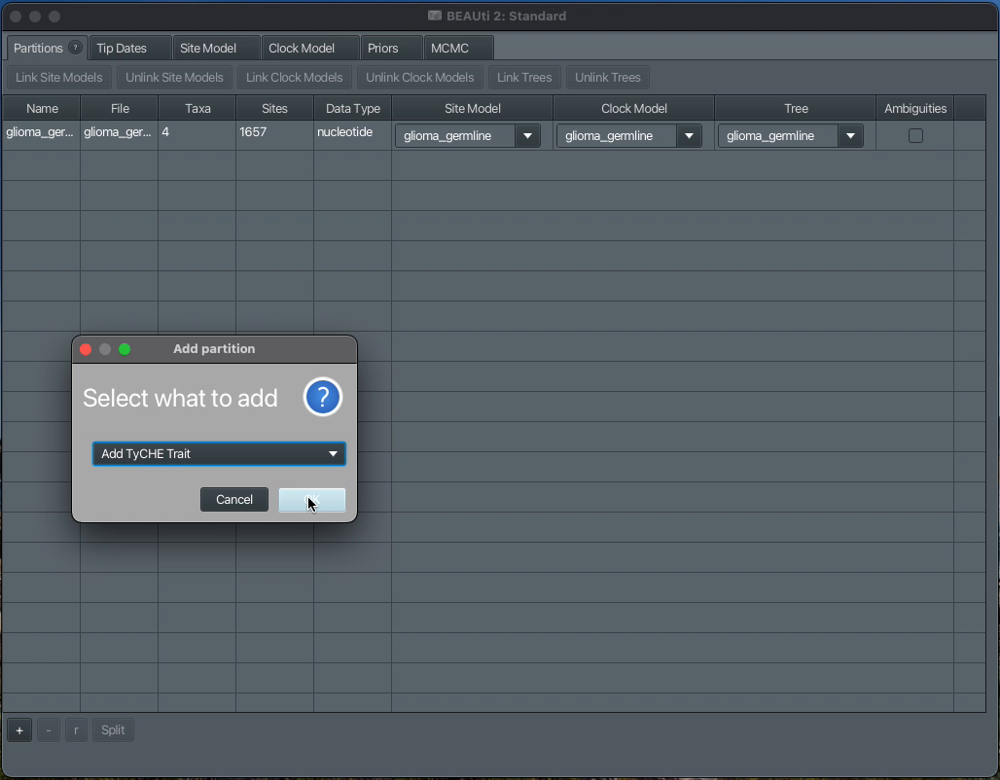

   Add partition dialog, Add TyCHE Trait selected

A small dialog asks for a name for the trait and which tree to link it
to — the default name (``newTrait``) is fine to keep, and the tree
should already point at the one partition you have so far:

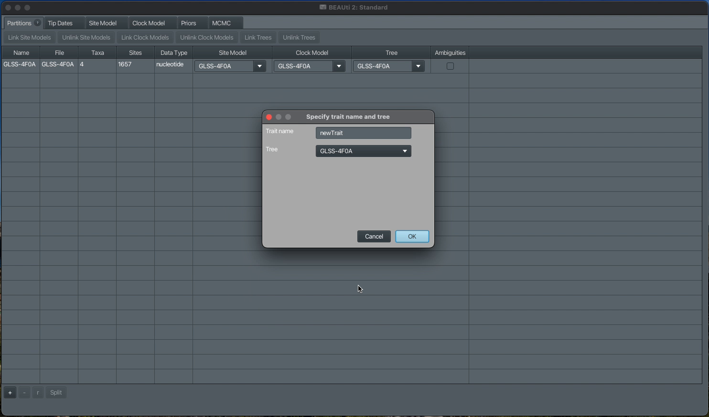

   Specify trait name and tree dialog

Click OK. This opens the TyCHE trait editor, listing every taxon in your
alignment with an empty **Trait** column:

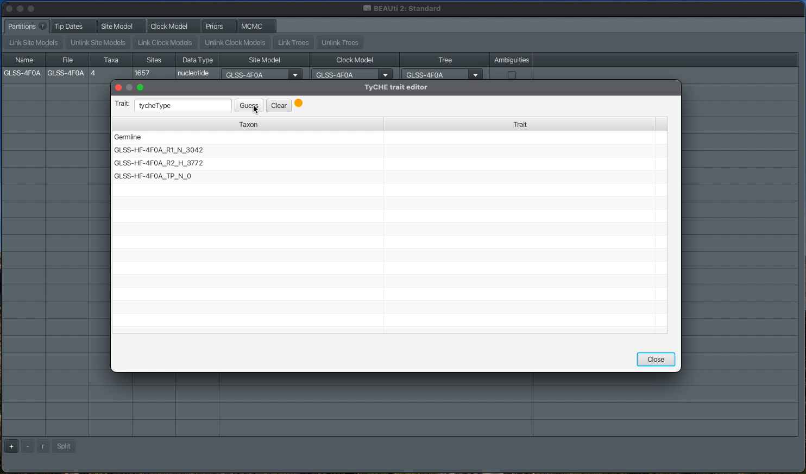

   TyCHE trait editor, empty

You can name the trait itself in the **Trait** field at the top (the
default is ``tycheType``). Click **Guess** to fill in every row at once
from a pattern in the taxon names.

In our glioma dataset, choose **split on character**, enter ``_`` as the
character to split on, and pick the third group, which is H for hypermutator
or N for non-hypermutator:

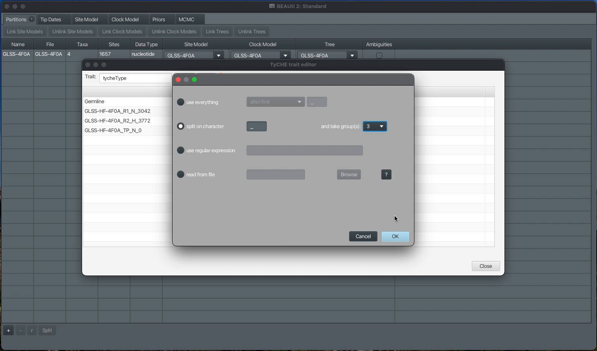

   Guess dialog, split on underscore, group 3

Click OK. Any taxon whose name doesn’t match your pattern is
automatically set to ``?``, which stands for an ambiguous tip, whose
trait is not known. ``Germline``
doesn’t fit the naming pattern the other taxa use, so it’s correctly
marked unknown rather than guessed at:

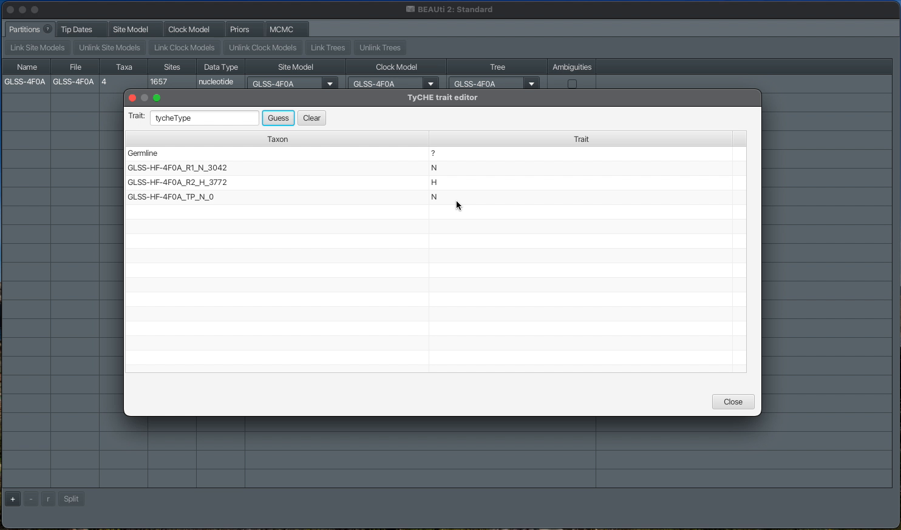

   TyCHE trait editor after using Guess

You can still click into any cell and edit it by hand afterward — useful
for double-checking a taxon Guess couldn’t classify, or fixing one it
got wrong. Close the dialog when you’re done.

3. (Optional) Set tip dates
---------------------------

If your samples were collected at different times, set that up from the
**Tip Dates** tab — check **Use tip dates**, then either type each date
in directly or use **Auto-configure**. BEAUti's Tip Date editor cannot
guess from taxon names when any tips are present that don't match the
pattern, so **Auto-configure** can only be used to get dates from a
file in a germline-rooted tree.

Set the date for ``Germline`` to 0, as it will be automatically estimated
with the root during the actual BEAST2 run.

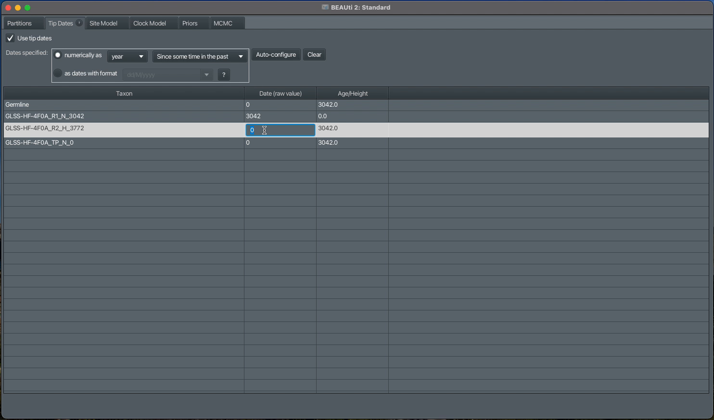

   Tip Dates tab, entering a date

If none of your samples have meaningful collection dates, skip this tab
entirely.

4. Check the partitions table
-----------------------------

Both partitions now show up together:

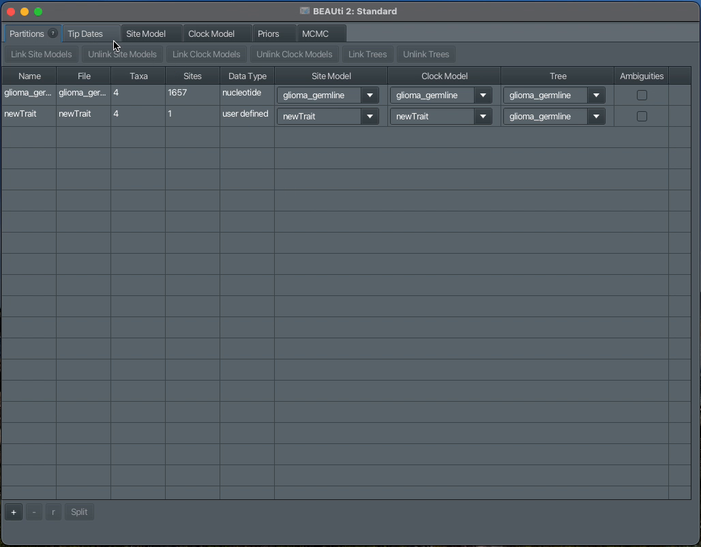

   Partitions table with both partitions linked

Both partitions’ **Tree** column points at the same tree — this
is correct.

5. Set the clock model
----------------------

Clock Model tab → select the **sequence** partition ``GLSS-4F0A`` (left panel) →
choose **Tyche Expected Occupancy** from the dropdown. This will automatically
populate the trait partition dropdown with a TyCHE trait if you have added one.
If you have multiple TyCHE traits, you can pick one using the **Trait
partition** dropdown.

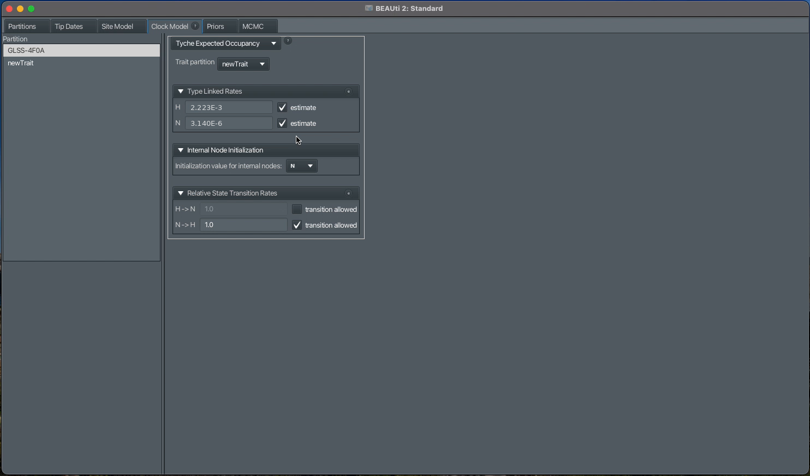

   Clock Model tab fully configured

Three panels appear once a trait partition is linked:

-  **Type Linked Rates** — one row per trait value, each with its own
   estimated rate and an **estimate** checkbox.
-  **Internal Node Initialization** — which trait value internal nodes
   start at, before MCMC has a chance to sample anything better.
-  **Relative State Transition Rates** — one row per *direction* of
   change between trait values (``H → N``, ``N → H``, …), each with its
   own rate and an **allowed** checkbox. Unchecking a row disables its
   rate field, meaning that direction of change is not allowed in the
   model at all — this example makes ``H → N`` impossible, so the trait
   can only ever change one way.

For our example:

-  **Type Linked Rates** should be ``H = 2.223E-3`` and
   ``N = 3.140E-6``.
-  **Internal Node Initialization** should be ``N``, so that there are
   no impossible switches in the initial tree, since we disallow switches
   from ``H`` to ``N``.
-  **Relative State Transition Rates** should make sure that the **allowed**
   checkbox for ``H → N`` is unchecked. The value of the only allowed transition
   can be left as 1, since these are relative rates.

The small button on the **Type Linked Rates** and **Relative State
Transition Rates** panel titles each open a more detailed, native
parameter editor, which is useful for setting a specific
upper or lower bound. The bounds will apply to every rate, not to each
individually.

Note: The Site Model tab shows the same transition rates
-----------------------------------------------------

Selecting the trait partition (``newTrait``) from the **Site Model** tab shows the
same **Relative State Transition Rates** panel you just saw on the Clock
Model tab:

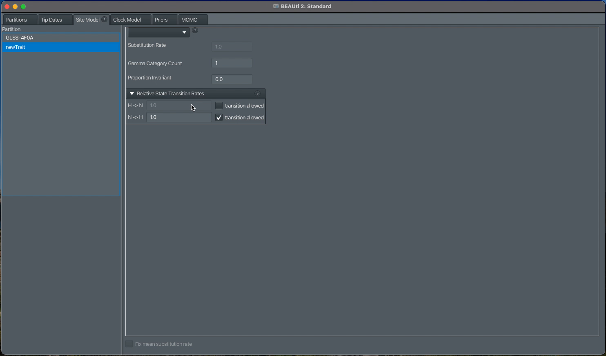

   Site Model tab, same transition rates panel

This is the same information, not a separate copy — editing a rate or a
checkbox in either tab updates the other. Use whichever tab you happen
to be in; there’s no need to set this up twice.

6. Review the priors
--------------------

Navigate to the **Priors** tab.

Expand the **type-linked rates prior**. It can be further expanded per rate value, each
showing its own distribution with a live density plot you can use to
sanity-check the shape of your prior:

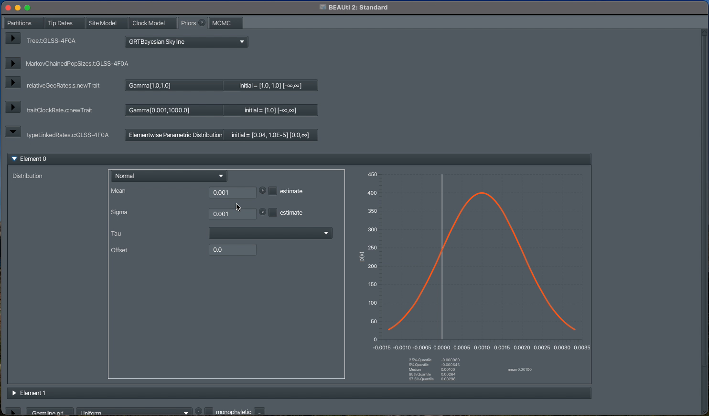

   Elementwise prior, expanded, showing the density plot

For the glioma example, we recommend setting:

-  Element0 (``H``): ``Mean = 2.223E-3`` and ``Sigma = 2.223E-6``
-  Element1 (``N``): ``Mean = 3.140E-6`` and ``Sigma = 3.140E-9``

Expand the **GRTBayesianSkyline tree prior**, to see its full settings. Because we have so few
tips, we need to adjust the number of groups, which we will do by clicking on the small round
button next to ``Pop Sizes`` and setting the ``Dimension`` to ``1``. We will do the same for ``Group Sizes``.

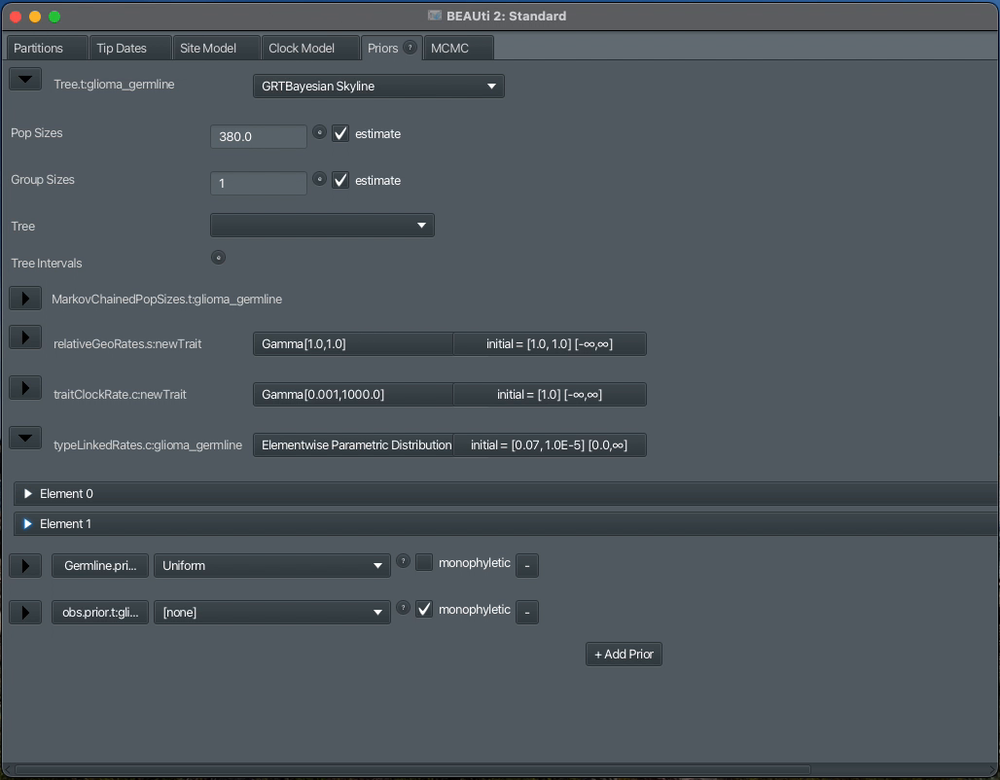

   Tree prior

``obs.prior`` is the constraint that everything
*except* ``Germline`` forms one group, which is what makes ``Germline``
the outgroup. This is set automatically on import and you shouldn't need to change it.

7. Save your file
-----------------

File → Save.

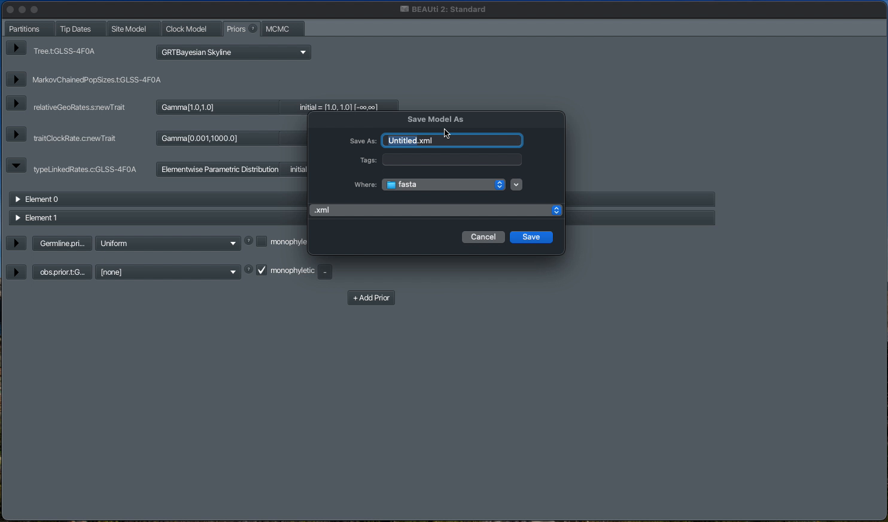

   Save dialog

Your analysis is ready to run.

8. Run your analysis in BEAST2
-------------------------------

Launch BEAST2 and import the file you just saved.

